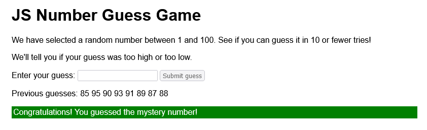
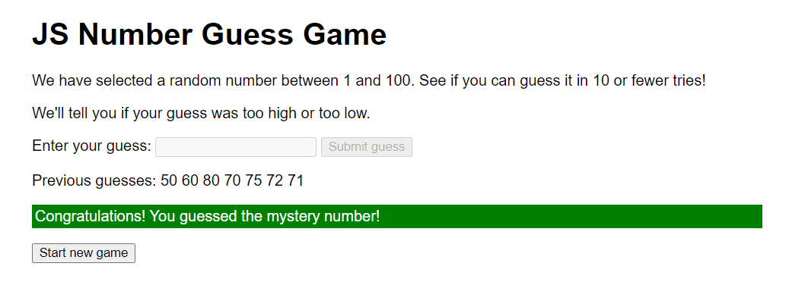

## Overview

Build a JavaScript number guess game that:

 - generates a random number between 1 and 100
 - gives the user 10 tries to guess the mystery number
 - tells users if their guess was too high or too low
 - keeps track of users' previous guesses
 - changes the background color of the user's guess to red if the guess was incorrect
 - changes the background color of the user's guess to green if the guess was correct
 - tells the user the game is over if the user doesn't guess the mystery number in 10 (or fewer) tries
 - uses a function to check the user's guess
 - uses a function to add a RESET button to the page
 - uses a function to reset the game so the user can play again

## Your GitHub Repo

 - Duplicate the starter repo and name your copy of the repo: **num-guess-game-js**
 - Submit the URL for your repo on Google Classroom

## Sample Output

Your finished game will look similar to these examples:

## Helpful Resources

 - [Generating a random integer](https://www.w3schools.com/js/tryit.asp?filename=tryjs_random_1_100) 
 - [JS Number ( ) method](https://www.w3schools.com/jsref/jsref_number.asp)
 - [JS backgroundColor property](https://www.w3schools.com/jsref/prop_style_backgroundcolor.asp)
 - [JS textContent property](https://www.w3schools.com/jsref/prop_node_textcontent.asp)
 - [JS createElement ( ) method](https://www.w3schools.com/jsref/met_document_createelement.asp)
 - [JS focus ( ) method](https://www.w3schools.com/jsref/met_html_focus.asp)
 - [JS append ( ) method](https://developer.mozilla.org/en-US/docs/Web/API/Element/append)
 - [JS querySelectorAll ( ) method](https://www.w3schools.com/jsref/met_document_queryselectorall.asp)
 - [JS for...of loop](https://developer.mozilla.org/en-US/docs/Web/JavaScript/Reference/Statements/for...of)

## Directions

 - Follow the instructions on Google Classroom for each part of this project 

      

